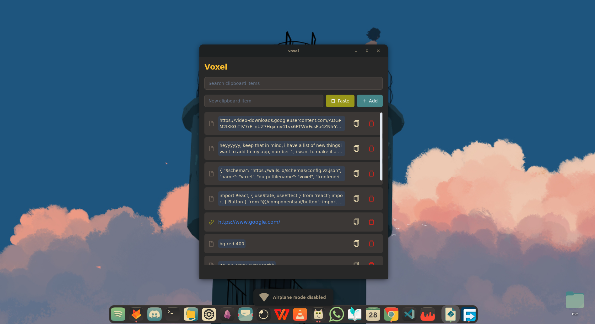

# Voxel

Voxel is a simple, lightweight clipboard manager built with Go and React.



## Features

- Effortlessly manage your clipboard history
- User-friendly interface built with React
- Lightweight and efficient, powered by Go
- clipboard watcher (automatically update clipboard list when copy item)
- persistent: store in a sqlite file

## Installation

### Prerequisites

- Go (version 1.16 or later)
- Node.js and npm
- Wails (for building the application)

### Building from Source

1. Clone the repository:
   ```
   git clone https://github.com/sijirama/voxel.git
   cd voxel
   ```

2. Install dependencies:
   ```
   go mod tidy
   cd frontend && npm install && cd ..
   ```

3. Build the application:
   ```
   wails build
   ```

4. Install the application:
   ```
   sudo ./install.sh
   ```

### Uninstalling

To uninstall Voxel:

```
sudo ./uninstall.sh
```

## Usage

After installation, you can launch Voxel from your application menu or by typing `voxel` in the terminal (this is only for linux users, thank you)


## Development

This project uses Wails for building a native application with Go and React. To set up your development environment:

1. Install Wails by following the [official Wails installation guide](https://wails.io/docs/gettingstarted/installation).

2. Run the application in development mode:
   ```
   wails dev
   ```

## Contributing

Contributions are welcome! Please feel free to submit a Pull Request.


## Acknowledgements

- [Wails](https://wails.io/) for making it easy to build desktop applications with Go and Web Technologies.
- [React](https://reactjs.org/) for the frontend framework.
- [Go](https://golang.org/) for the backend language.
